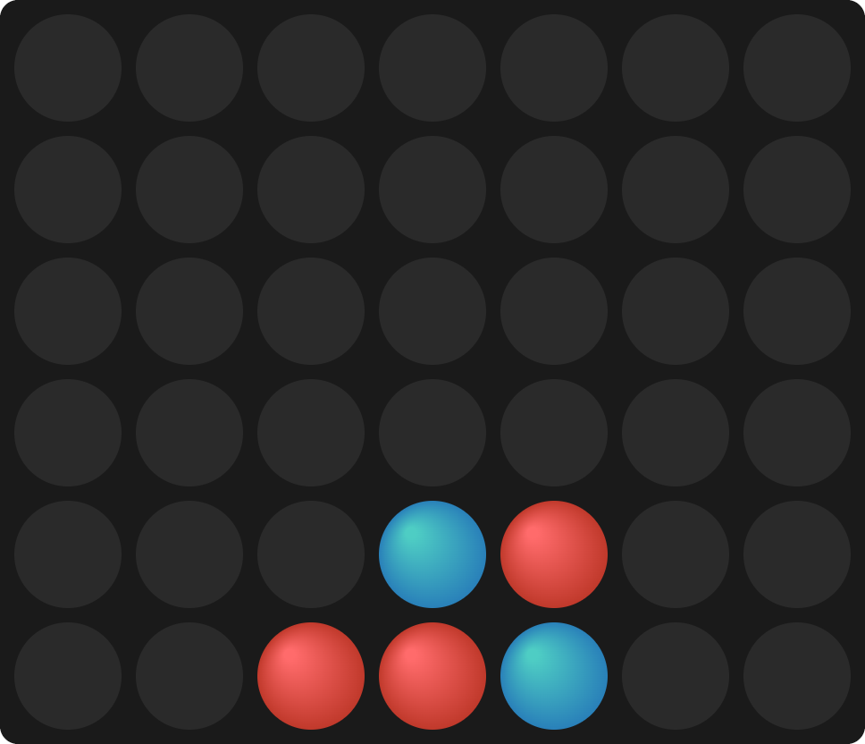
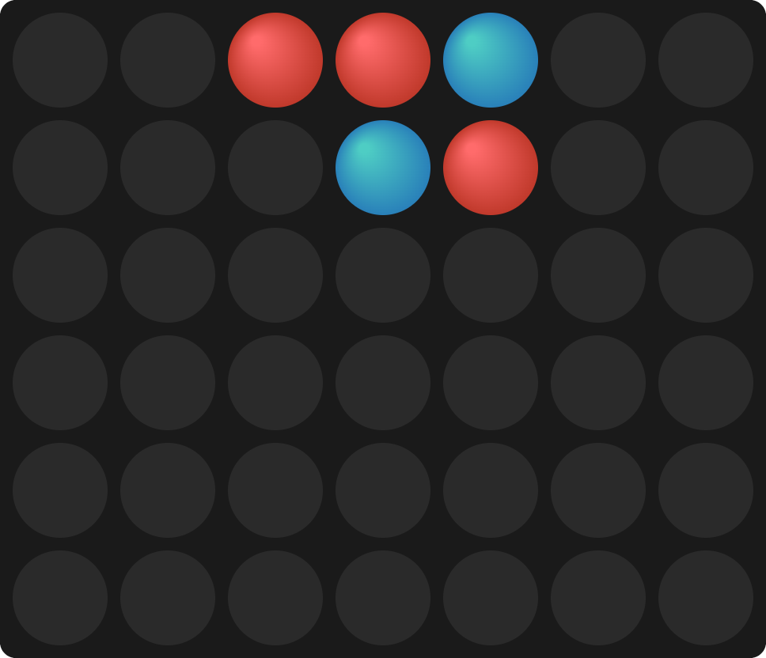

# 🔄 重力反转四子棋

[English README](README.en.md) | [中文 README](README.md)

一个独特的四子棋变体，每隔若干回合重力方向会发生反转，棋子会随着重力重新分布！

## 🎮 游戏规则

1. **基本规则**：在7列棋盘中点击投放棋子，先连成4个同色棋子（横、竖、斜）者获胜
2. **重力机制**：棋子受重力影响自动下落
3. **重力反转**：每6个回合重力方向反转
   - ⬇️ 重力向下：从顶部投放，棋子靠底部
   - ⬆️ 重力向上：从底部投放，棋子靠顶部
4. **重新分布**：重力反转时，所有棋子会自动重新分布到新的重力方向

## 🎯 特色功能

- 🎨 精美的渐变背景和3D棋子效果
- 🔄 创新的重力反转机制
- 📱 响应式设计，支持手机和平板
- 🏆 胜利/平局提示
- 🔄 重新开始功能

## 🚀 快速开始

直接在浏览器中打开 `index.html` 即可开始游戏！

无需任何安装或构建工具。

## 📝 游戏示例

| 重力向下（默认）⬇️ | 重力反转后（向上）⬆️ |
|:---:|:---:|
| 顶部投放，棋子靠底部 | 底部投放，棋子靠顶部 |
|  |  |

## 📄 许可证

本项目采用 [MIT 许可证](LICENSE) - 详见 [LICENSE](LICENSE) 文件。

## 🙏 致谢

经典四子棋游戏的创新变体。

---

[返回顶部](#-重力反转四子棋)